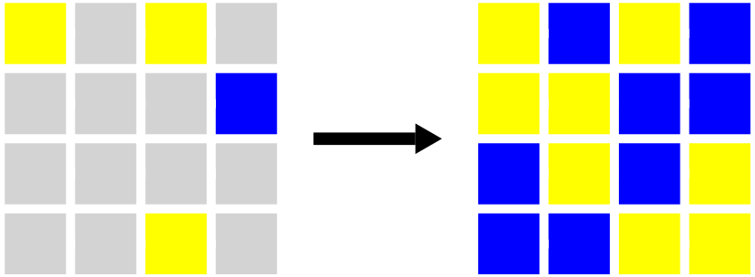
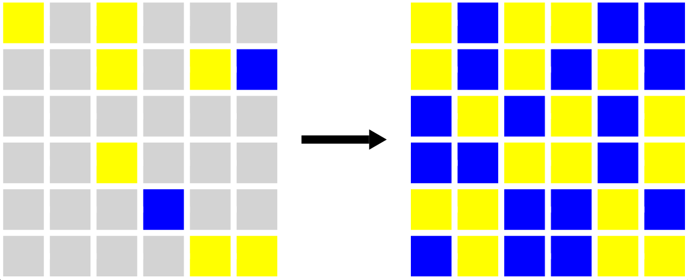
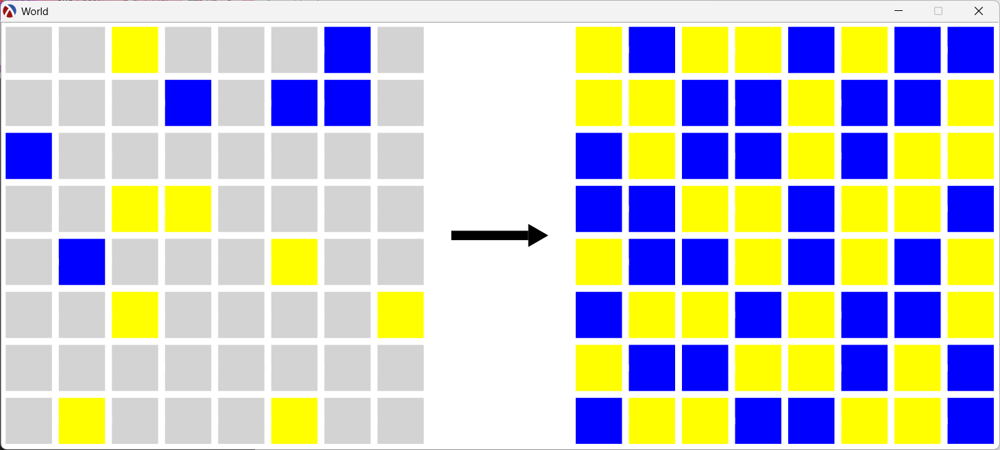
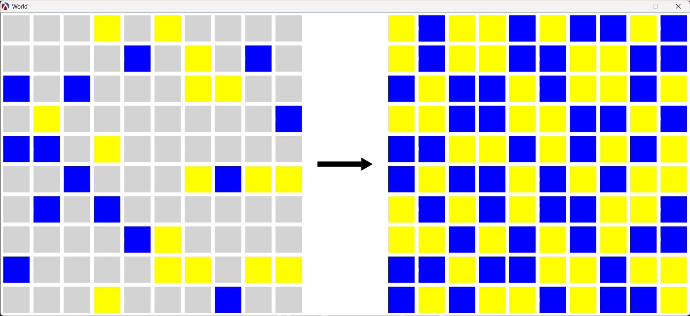

# 0h h1 Solver

This portfolio project is an implementation of a simple sudoku-like logic game called [0h h1](https://0hh1.com/).

After completing PF1, I still personally felt that there were not enough search problems in the course. To make sure that I learned the material, I'm implementing my own search problem with my own data definitions.

Furthermore, this is so late because I'm currently working through PF2 and PF4, so I ended up being too distracted from doing the other two projects. If I'm gonna do those projects, I think I would have to start from scratch.

## Implementation

> Download and run [`ohhi.rkt`](./ohhi.rkt) here.

## How do I run the solver?

1. Download and install [Racket](https://racket-lang.org/).
2. Set the language to `Intermediate Student with Lambda`.
3. Open and run `ohhi.rkt`. (Note: It will take at least 30s to finish. 🤡)
4. Once run, you can solve any 0hh1 puzzle using any starting 0hh1 puzzle and the `solver-with-renderer-nw` function.
5. **The starting puzzle**: You will have to hard-code the starting puzzle. Get any [starting puzzle here](https://0hh1.com/). See the [starter templates](#starter-0hh1-templates) below. Fill in the given colored blocks.
6. **The function**: Use the `solver-with-renderer-nw` function with your hard-coded starting puzzle. The solution will be shown as an image in a new window.

## Starter 0hh1 Templates

### 4x4

```racket
(list N N  N N
      N N  N N

      N N  N N
      N N  N N)
```

### 6x6

```racket
(list N N N  N N N
      N N N  N N N
      N N N  N N N

      N N N  N N N
      N N N  N N N
      N N N  N N N)
```

### 8x8

```racket
(list N N N N  N N N N
      N N N N  N N N N
      N N N N  N N N N
      N N N N  N N N N

      N N N N  N N N N
      N N N N  N N N N
      N N N N  N N N N
      N N N N  N N N N)
```

### 10x10

```racket
(list N N N N N  N N N N N
      N N N N N  N N N N N
      N N N N N  N N N N N
      N N N N N  N N N N N
      N N N N N  N N N N N

      N N N N N  N N N N N
      N N N N N  N N N N N
      N N N N N  N N N N N
      N N N N N  N N N N N
      N N N N N  N N N N N)
```

### 12x12

```racket
(list N N N N N N  N N N N N N
      N N N N N N  N N N N N N
      N N N N N N  N N N N N N
      N N N N N N  N N N N N N
      N N N N N N  N N N N N N
      N N N N N N  N N N N N N

      N N N N N N  N N N N N N
      N N N N N N  N N N N N N
      N N N N N N  N N N N N N
      N N N N N N  N N N N N N
      N N N N N N  N N N N N N
      N N N N N N  N N N N N N)
```

## Screenshots

### 4x4 Example

```racket
(solver-with-renderer-nw (list Y N Y N
                               N N N B
                               N N N N
                               N N Y N))
```



### 6x6 Example

```racket
(solver-with-renderer-nw (list Y N Y  N N N
                               N N Y  N Y B
                               N N N  N N N

                               N N Y  N N N
                               N N N  B N N
                               N N N  N Y Y))
```



### 8x8 Example

```racket
(solver-with-renderer-nw (list N N Y N  N N B N
                               N N N B  N B B N
                               B N N N  N N N N
                               N N Y Y  N N N N

                               N B N N  N Y N N
                               N N Y N  N N N Y
                               N N N N  N N N N
                               N Y N N  N Y N N))
```



### 10x10 Example

```racket
(solver-with-renderer-nw (list N N N Y N  Y N N N N
                               N N N N B  N Y N B N
                               B N B N N  N Y Y N N
                               N Y N N N  N N N N B
                               B B N Y N  N N N N N

                               N N B N N  N Y B Y Y
                               N B N B N  N N N N N
                               N N N N B  Y N N N N
                               B N N N N  Y Y N Y Y
                               N N N Y N  N N B N N))
```



### 12x12 Example

```racket
(solver-with-renderer-nw (list N N Y Y N N  N B N Y N N
                               Y N N N N N  Y N N Y N N
                               N Y N N B N  N B N N N N
                               N N Y N N N  N N N N N B
                               N N N N N N  N N N N B N
                               N B B N N N  N Y Y N N N

                               N N N N N N  N Y Y N Y N
                               B N N N N N  N N N N N Y
                               N B N N B B  N N Y N N N
                               N N Y N B N  N N N Y N Y
                               Y N N N N N  N N N N N N
                               N B N B N N  Y Y N N N Y))
```

It takes so long for the solver to finish a 12x12 😭💀 I still don't know how to make this program performant help me
